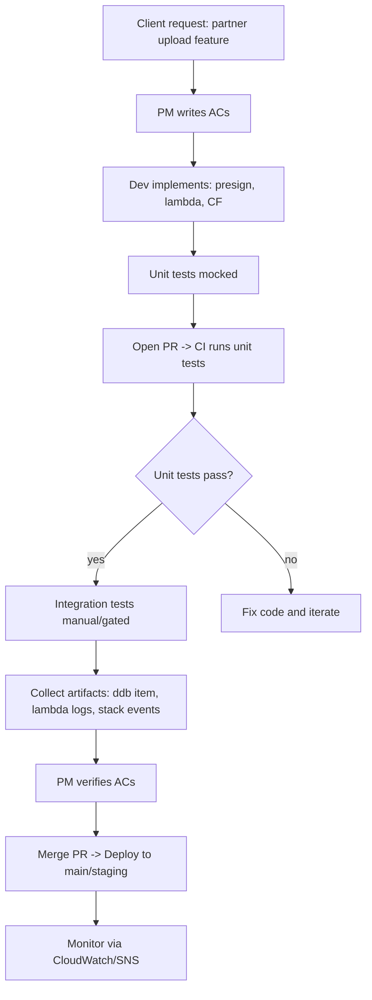
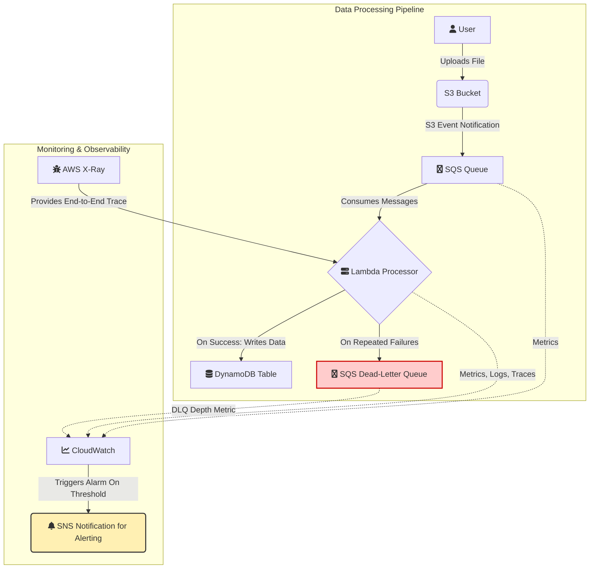

# Day 4 — Infra 


This is to record each run. Replace <PLACEHOLDERS> with real values and paste command outputs under each section.


## Run metadata
- Run date: <YYYY-MM-DD>
- Runner: <Your Name>
- AWS profile: <AWS_PROFILE>
- AWS region: <AWS_REGION>
- Stack name (CF): <STACK_NAME or NONE>

## Resources created / used
- S3 bucket: <BUCKET>
- Lambda function name: <LAMBDA_NAME>
- DynamoDB table: <TABLE>
- IAM role (Lambda): <ROLE_ARN or name>
- SNS topic (alerts): <SNS_ARN or NONE>

## Commands executed (paste exact commands you ran)
1. Validate template


aws cloudformation validate-template --template-body file://templates/s3-lambda-dynamo.yml

2. Deploy stack


aws cloudformation deploy --template-file templates/s3-lambda-dynamo.yml --stack-name s3-lambda-dynamo-stack --capabilities CAPABILITY_NAMED_IAM --parameter-overrides BucketName=<BUCKET> LambdaName=<LAMBDA_NAME> DynamoTableName=<TABLE>

3. Update Lambda code


zip -r lambda_package.zip scripts/lambda_handler.py
aws lambda update-function-code --function-name <LAMBDA_NAME> --zip-file fileb://lambda_package.zip

4. Configure S3 notification (if needed)


aws s3api put-bucket-notification-configuration --bucket <BUCKET> --notification-configuration file://templates/notification.json


## Evidence / outputs (paste CLI output)
- `aws cloudformation describe-stacks --stack-name <STACK_NAME>` (paste JSON)
- `aws lambda get-function --function-name <LAMBDA_NAME>` (paste relevant parts)
- `aws dynamodb describe-table --table-name <TABLE>` (paste)
- `aws s3api get-bucket-encryption --bucket <BUCKET>` (paste)
- Unit test results (paste first ~20 lines from `artifacts/unit-test-results.txt`)
- Integration test results (paste first ~20 lines from `artifacts/integration-test-output.txt`)
- DynamoDB item JSON (`artifacts/dynamodb_item_<key>.json`) — paste or attach file
- CloudWatch logs snippet (`artifacts/lambda_logs_<key>.json`) — paste or attach file

## Acceptance checklist
- [ ] Stack deployed successfully (CREATE_COMPLETE)
- [ ] Lambda code deployed and permission to be invoked by S3 present
- [ ] S3 object upload triggers Lambda and Lambda writes to DynamoDB
- [ ] CloudWatch logs show successful processing message
- [ ] Unit tests passing (attach `artifacts/unit-test-results.txt`)
- [ ] Integration test passing (attach `artifacts/integration-test-output.txt`)


## s3 bucket check 
 $ aws s3api get-bucket-notification-configuration --bucket lambdandynam-static-01-01123581321 --profile admin01 --region eu-central-1
{
    "LambdaFunctionConfigurations": [
        {
            "Id": "ZjhiODE2ZTUtYjE4MC00OWM0LTg5MGMtOGMyM2U5MzdjMjNj",
            "LambdaFunctionArn": "arn:aws:lambda:eu-central-1:131471595295:function:lambda-static-01",
            "Events": [
                "s3:ObjectCreated:*"
            ]
        }
    ]
}

(.venv) 


## Lambda functon check 
$ aws lambda get-function --function-name lambda-static-01 --profile admin01 --region eu-central-1
{
    "Configuration": {
        "FunctionName": "lambda-static-01",
        "FunctionArn": "arn:aws:lambda:eu-central-1:131471595295:function:lambda-static-01",
        "Runtime": "python3.10",
        "Role": "arn:aws:iam::131471595295:role/lambda-static-01-role",
        "Handler": "scripts.lambda_handler.handler",
        "CodeSize": 3270,
        "Description": "",
        "Timeout": 3,
        "MemorySize": 128,
        "LastModified": "2025-09-28T14:31:13.000+0000",
        "CodeSha256": "s7eqthFi4btPDCy2MdQ9l3RDPytpz9Ok3R9M/JGbpFo=",
        "Version": "$LATEST",
        "Environment": {
            "Variables": {
                "DDB_TABLE": "dynamotable-static-01"


## Actual Lambdahandler package deployed
$ aws lambda update-function-code --function-name lambda-static-01 --zip-file fileb://scripts.zip --profile adm
in01 --region eu-central-1
{
    "FunctionName": "lambda-static-01",
    "FunctionArn": "arn:aws:lambda:eu-central-1:131471595295:function:lambda-static-01",
    "Runtime": "python3.10",
    "Role": "arn:aws:iam::131471595295:role/lambda-static-01-role",
    "Handler": "scripts.lambda_handler.handler",
    "CodeSize": 3270,
    "Description": "",
    "Timeout": 3,
    "MemorySize": 128,
    "LastModified": "2025-09-28T19:07:28.000+0000",
    "CodeSha256": "s7eqthFi4btPDCy2MdQ9l3RDPytpz9Ok3R9M/JGbpFo=",
    "Version": "$LATEST",
    "Environment": {
        "Variables": {
            "DDB_TABLE": "dynamotable-static-01"
        }
    },
-- More  --

## Invokte the Lambda manually
$ aws lambda invoke     --function-name lambda-static-01     --payload fileb://test-json.json     --cli-binary-
format raw-in-base64-out     --log-type Tail     response.txt     --profile admin01     --region eu-central-1  
{
    "StatusCode": 200,
    "LogResult": "W0lORk9dCTIwMjUtMDktMjhUMTk6MTQ6MjAuNjgxWgkJRm91bmQgY3JlZGVudGlhbHMgaW4gZW52aXJvbm1lbnQgdmFyaWFibGVzLgpTVEFSVCBSZXF1ZXN0SWQ6IDZlOWM0MzlkLTBiNzAtNGMwOC1iYThkLTRkOGUzMzI3Y2QwMiBWZXJzaW9uOiAkTEFURVNUCkVORCBSZXF1ZXN0SWQ6IDZlOWM0MzlkLTBiNzAtNGMwOC1iYThkLTRkOGUzMzI3Y2QwMgpSRVBPUlQgUmVxdWVzdElkOiA2ZTljNDM5ZC0wYjcwLTRjMDgtYmE4ZC00ZDhlMzMyN2NkMDIJRHVyYXRpb246IDIxLjA2IG1zCUJpbGxlZCBEdXJhdGlvbjogNjAzIG1zCU1lbW9yeSBTaXplOiAxMjggTUIJTWF4IE1lbW9yeSBVc2VkOiA4NyBNQglJbml0IER1cmF0aW9uOiA1ODEuMDggbXMJCg==",
    "ExecutedVersion": "$LATEST"
}

(.venv) 

## AWS LogGroup 
 $ # Check all log groups related to lambda
aws logs describe-log-groups --profile admin01 --region eu-central-1 | grep lambda
            "logGroupName": "/aws/lambda/lambda-static-01",
            "arn": "arn:aws:logs:eu-central-1:131471595295:log-group:/aws/lambda/lambda-static-01:*",
            "logGroupArn": "arn:aws:logs:eu-central-1:131471595295:log-group:/aws/lambda/lambda-static-01"   

aws logs describe-log-groups --profile admin01 --region eu-central-1 --query "logGroups[?contains(logGroupName, 'lambda-static-01')].logGroupName" --output table
----------------------------------
|        DescribeLogGroups       |
+--------------------------------+
|  /aws/lambda/lambda-static-01  |
+--------------------------------+

(.venv) 


## Logstreams 
$ MSYS_NO_PATHCONV=1 aws logs describe-log-streams --log-group-name "/aws/lambda/lambda-static-01" --profile admin01 --region eu-central-1
{
    "logStreams": [
        {
            "logStreamName": "2025/09/28/[$LATEST]051330842e254453a90d5618e054e1ea",
            "creationTime": 1759068938030,
            "firstEventTimestamp": 1759068937806,
            "lastEventTimestamp": 1759069565839,
            "lastIngestionTime": 1759069565864,
            "uploadSequenceToken": "49039859645912956947113898318046020901666494914589253030",
            "arn": "arn:aws:logs:eu-central-1:131471595295:log-group:/aws/lambda/lambda-static-01:log-stream:2025/09/28/[$LATEST]051330842e254453a90d5618e054e1ea",
            "storedBytes": 0
        },
        {
            "logStreamName": "2025/09/28/[$LATEST]34a481630eb1490d9c2b565abbc0e379",
            "creationTime": 1759087476144,
            "firstEventTimestamp": 1759087473134,
            "lastEventTimestamp": 1759087474199,
            "lastIngestionTime": 1759087476152,
            "uploadSequenceToken": "49039859645936763803336068947385500876294648316362644814",
            "arn": "arn:aws:logs:eu-central-1:131471595295:log-group:/aws/lambda/lambda-static-01:log-stream:2025/09/28/[$LATEST]34a481630eb1490d9c2b565abbc0e379",
            "storedBytes": 0
        },
        {
-- More  --


## DynamoDB table 
 $ aws dynamodb scan --table-name dynamotable-static-01 --profile admin01 --region eu-central-1
{
    "Items": [
        {
            "size": {
                "N": "13"
            },
            "processing_status": {
                "S": "RECEIVED"
            },
            "s3_bucket": {
                "S": "lambdandynam-static-01-01123581321"
            },
            "s3_key": {
                "S": "test-file.txt"
            },
            "content_type": {
                "S": "text/plain"
            }
        }
    ],
    "Count": 1,
    "ScannedCount": 1,
    "ConsumedCapacity": null
}


## AWS SNS alert 
 $ aws sns create-topic --name lambda-alerts
{
    "TopicArn": "arn:aws:sns:eu-central-1:131471595295:lambda-alerts"
}

Confirming the subscription
Subscription confirmed!
You have successfully subscribed.

Your subscription's id is:
arn:aws:sns:eu-central-1:131471595295:lambda-alerts:e443465f-8422-43a0-8503-0a8791872fcd

If it was not your intention to subscribe, click here to unsubscribe.

Command: 
- aws cloudwatch put-metric-alarm   --alarm-name "lambda-alerts-Errors"   --metric-name "Errors"   --namespace "AWS/Lambda"   --statistic Sum   --period 300   --threshold 1   --comparison-operator GreaterThanOrEqualToThreshold   --evaluation-periods 1   --dimensions Name=FunctionName,Value=lambda-static-01  --alarm-actions arn:aws:sns:eu-central-1:131471595295:lambda-alerts 

### Fake a faliure to check the SNS email subscription
View this alarm in the AWS Management Console:
https://eu-central-1.console.aws.amazon.com/cloudwatch/deeplink.js?region=eu-central-1#alarmsV2:alarm/lambda-alerts-Errors

Alarm Details:
- Name:                       lambda-alerts-Errors
- Description:               
- State Change:               OK -> ALARM
- Reason for State Change:    Threshold Crossed: 1 datapoint [1.0 (28/09/25 20:37:00)] was greater than or equal to the threshold (1.0).
- Timestamp:                  Sunday 28 September, 2025 20:42:18 UTC
- AWS Account:                131471595295
- Alarm Arn:                  arn:aws:cloudwatch:eu-central-1:131471595295:alarm:lambda-alerts-Errors

Threshold:
- The alarm is in the ALARM state when the metric is GreaterThanOrEqualToThreshold 1.0 for at least 1 of the last 1 period(s) of 300 seconds.

Monitored Metric:
- MetricNamespace:                     AWS/Lambda
- MetricName:                          Errors
- Dimensions:                          [FunctionName = lambda-static-01]
- Period:                              300 seconds
- Statistic:                           Sum
- Unit:                                not specified


State Change Actions:
- OK:
- ALARM: [arn:aws:sns:eu-central-1:131471595295:lambda-alerts]
- INSUFFICIENT_DATA:


## Integration test in GitHub

[](https://github.com/MoeNamini/infra/actions/workflows/ci-lambda-test.yml)

<testsuites name="pytest tests">
<testsuite name="pytest" errors="0" failures="0" skipped="0" tests="1" time="0.256" timestamp="2025-09-29T08:38:33.379058+00:00" hostname="runnervm3ublj">
<testcase classname="tests.test_lambda_unit" name="test_handler_writes_ddb" time="0.002"/>
</testsuite>
</testsuites>


## The artifacts - test reports uploaded 
'artifacts/integration-test-output.txt' — captured console output (human readable).
artifacts/integration-junit.xml — test runner JUnit XML (machine friendly).
artifacts/dynamodb_item_<key>.json —  # the DynamoDB GetItem JSON proving the item was created.
artifacts/lambda_logs_<key>.json — CloudWatch events for the Lambda invocation.
CloudFormation stack events / outputs (if you used CF) — run and save:
- aws cloudformation describe-stacks --stack-name s3-lambda-dynamo-stack > artifacts/stack-describe.json
- aws cloudformation describe-stack-events --stack-name s3-lambda-dynamo-stack > artifacts/stack-events.json
test-results.txt from unit tests (if you ran unit tests):
- pytest tests/test_lambda_unit.py -q | tee artifacts/unit-test-results.txt
- pytest --junitxml=artifacts/unit-junit.xml tests/test_lambda_unit.py || true

Why these artifacts: they are the minimal evidence proving the upload triggered Lambda, Lambda wrote to DynamoDB, and you have logs & stack evidence to debug or audit.

## Runbook — short (copy to docs/runbook-day4.md)

    Title: Runbook — S3 -> Lambda -> DynamoDB processing
    Purpose: How to verify, troubleshoot, and rollback the pipeline.
    Pre-reqs: AWS CLI configured, AWS_PROFILE pointing to account, jq installed.

 ### Verify system healthy
    1. Check CloudFormation stack:
    - aws cloudformation describe-stacks --stack-name s3-lambda-dynamo-stack | jq '.Stacks[0].StackStatus'

    2. Check Lambda errors metric:
    - aws cloudwatch get-metric-statistics --namespace AWS/Lambda --metric-name Errors --dimensions Name=FunctionName,Value=<LAMBDA_NAME> --start-time $(date -u -d '15 minutes ago' +%Y-%m-%dT%H:%M:%SZ) --end-time $(date -u +%Y-%m-%dT%H:%M:%SZ) --period 60 --statistics Sum

    3. Test a sample upload:
    - aws s3 cp test.txt s3://<BUCKET>/smoke/test-`date +%s`.txt --profile <PROFILE>

    4. Confirm DynamoDB item:
    - aws dynamodb get-item --table-name <TABLE> --key '{"s3_key":{"S":"smoke/test-<timestamp>.txt"}}' --profile <PROFILE>

 ### Triage upload failures

    1. Check CloudWatch logs for /<LAMBDA_NAME> and filter by time.
    2. Check CloudTrail for PutObject events and look for errorCode/errorMessage.
    3. Check S3 bucket policy & bucket encryption.

 ### Rollback (if needed)

    1. Disable S3 notification to Lambda (stop traffic).
    2. Re-deploy previous lambda package or roll CF stack back.
    3. Re-enable notifications after verification.

## A visual representation of the workflow 

### ASCII flowchart
CLIENT REQUEST (partner needs upload) 
          |
          v
[Requirement / AC defined by PM] 
          |
          v
[Dev] Implement presign generator + client upload + Lambda handler + CF template
          |
          v
[Unit Tests] (mock boto3) ------------------+
          |                                 |
          v                                 v
[Open PR / Feature Branch] ---> [CI: run unit tests] -> artifacts (test-results.txt, junit.xml)
          |
          v
[Integration (manual/gated)]
  - deploy CF to staging
  - run integration tests (upload file)
  - collect artifacts (dynamodb_item.json, lambda_logs.json)
          |
          v
[PM verifies ACs, reviews artifacts, merges PR]
          |
          v
[Deploy to production (if separate)]
          |
          v
[Monitoring: CloudWatch alerts via SNS]

### Mermaid 





## Git best practice workflow

Always use feature branches: feature/day4-s3-lambda, bug/fix-xyz, chore/docs.

Open a PR for merging even for solo: CI runs, artifacts, review comments, and PR description become documentation and evidence.

Protect main branch: require PRs, require CI to pass, optionally require an approval (even self-approval).

Use small commits and descriptive messages.

Use PR templates (create .github/PULL_REQUEST_TEMPLATE.md) with the acceptance checklist to copy/paste.

Tag releases for milestones: v0.1-day4.

https://claude.ai/public/artifacts/286d0f7d-d675-417c-a26f-6c29edf683f9
### Mermaid 
```mermaid
gitGraph
    commit id: "Initial commit"
    commit id: "Setup project"

    branch feature/day4-s3-lambda
    checkout feature/day4-s3-lambda
    commit id: "Add S3 bucket config"
    commit id: "Implement Lambda handler"
    commit id: "Add unit tests"

    checkout main
    branch bug/fix-xyz
    checkout bug/fix-xyz
    commit id: "Fix: Resolve API error"
    commit id: "Add error handling test"

    checkout main
    merge bug/fix-xyz tag: "PR #123 - CI ✓"

    checkout feature/day4-s3-lambda
    commit id: "Update dependencies"

    checkout main
    branch chore/docs
    checkout chore/docs
    commit id: "Update README"
    commit id: "Add PR template"

    checkout main
    merge chore/docs tag: "PR #124 - CI ✓"

    checkout feature/day4-s3-lambda
    merge main
    commit id: "Final review changes"

    checkout main
    merge feature/day4-s3-lambda tag: "PR #125 - CI ✓"

    commit id: "Release v1.2.0"
    ```