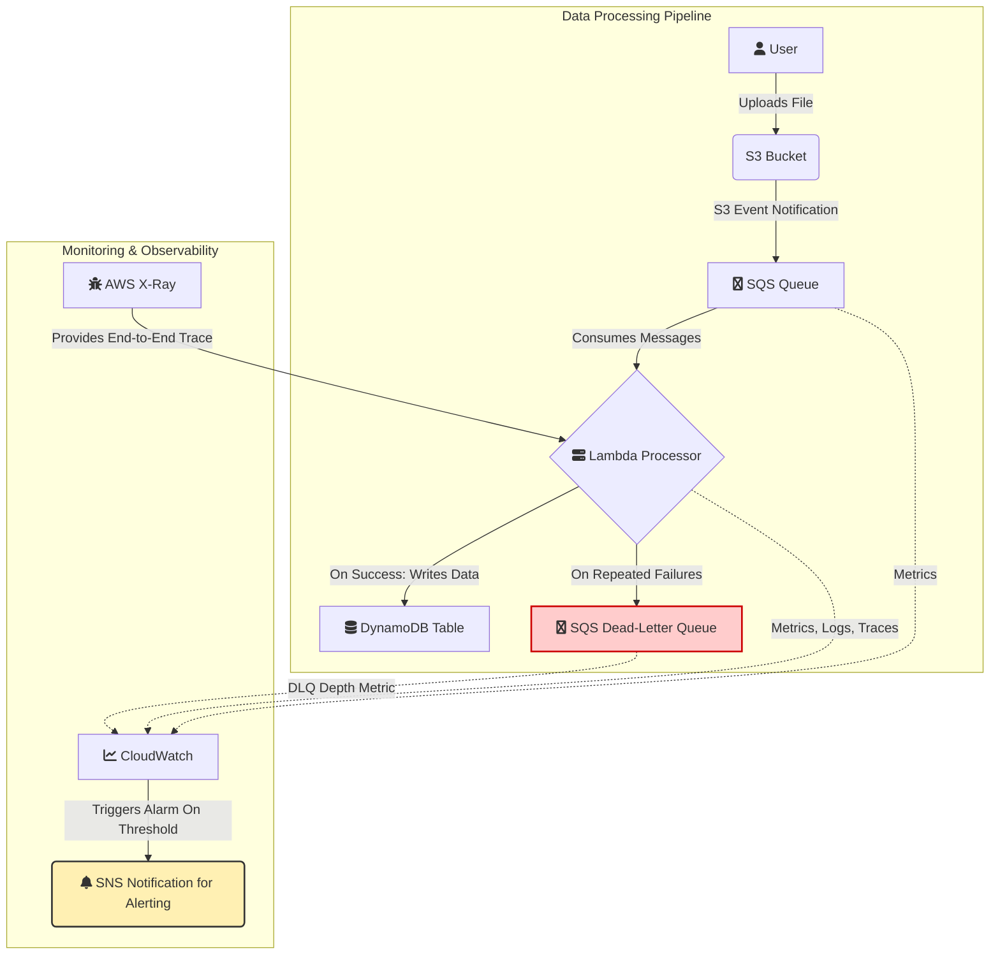

# Day 05

## Day 5 workflow diagram 

## Deploy CF s3-lambda-dynamo.yml (updated with SQS)
- aws cloudformation deploy \
  --template-file templates/s3-lambda-dynamo.yml \
  --stack-name s3-lambda-dynamo-stack \
  --capabilities CAPABILITY_NAMED_IAM \
  --parameter-overrides \
    BucketName=lambdandynam-static-01-01123581321 \
    LambdaName=lambda-static-01 \
    DynamoTableName=dynamotable-static-01

Waiting for changeset to be created..
Waiting for stack create/update to complete
Successfully created/updated stack - s3-lambda-dynamo-stack

(.venv)

'stack-resources.json' containe all the names & ARNs

## Implement S3->SQS pusher for more control 

How it works
S3 triggers a small Lambda on ObjectCreated.
Lambda inspects the event, optionally calls HeadObject to read contentType (and confirm size), validates/enriches, then calls sqs.send_message(...) with the final payload you want.

Pros
You can enrich the message (add contentType, custom metadata, generate presigned URLs, validate file extension or size).
You can filter events (ignore temp files, or only process PDFs).
You can combine small business logic (e.g., tag the object, call other APIs) before queueing.

Cons
Cost: Lambda invocations (and extra HeadObject calls) add cost.
Slightly higher latency.
Slightly more complexity to maintain.

S3 Notification directly to SQS (recommended when you don't need custom transformation): Configure S3 to send events to SQS queue. This is simple because S3 can send events to a queue directly; no extra function required.

Concept note: letting S3 publish directly to SQS reduces system complexity and cost. Use Lambda pusher only when you need to enrich/validate events before queueing.

## Include it to the CF and re-deploy 

### First a dry run
aws cloudformation create-change-set \
  --stack-name s3-lambda-dynamo-stack \
  --change-set-name sqsupdate \
  --template-body file://templates/s3-lambda-dynamo.yml \
  --capabilities CAPABILITY_NAMED_IAM \
  --parameters \
    ParameterKey=BucketName,ParameterValue=lambdandynam-static-01-01123581321 \
    ParameterKey=LambdaName,ParameterValue=lambda-static-01 \
    ParameterKey=DynamoTableName,ParameterValue=dynamotable-static-01

{
    "Id": "arn:aws:cloudformation:eu-central-1:131471595295:changeSet/sqsupdate/a6dcceb9-aca8-468e-8649-a28935b561e4",
    "StackId": "arn:aws:cloudformation:eu-central-1:131471595295:stack/s3-lambda-dynamo-stack/6ea98e40-9e0b-11f0-8138-0ad981efe0b1"
}

Then decribe change set 
aws cloudformation execute-change-set \
  --change-set-name sqsupdate \
  --stack-name s3-lambda-dynamo-stack

{
    "Changes": [
        {
            "Type": "Resource",
            "ResourceChange": {
                "Action": "Modify",
                "LogicalResourceId": "LambdaExecutionRole",
                "PhysicalResourceId": "lambda-static-01-role",
                "ResourceType": "AWS::IAM::Role",
                "Replacement": "False",
                "Scope": [
                    "Properties"
                ],
                "Details": [
                    {
                        "Target": {
                            "Attribute": "Properties",
                            "Name": "Policies",
                            "RequiresRecreation": "Never"
                        },
                        "Evaluation": "Static",
                        "ChangeSource": "DirectModification"
                    }
                ]
            }
        },

### Execute the changes 

aws cloudformation execute-change-set \
  --stack-name s3-lambda-dynamo-stack \
  --change-set-name sqsupdate \
  --stack-name s3-lambda-dynamo-stack

Checking the stack's status 
aws cloudformation describe-stacks   --stack-name s3-lambda-dynamo-stack   --query "Stacks
[0].Outputs"   --output json > CF-s3-lambda-dynamo-sqs.json
(.venv) 

### CF output - also saved in  CF-s3-lambda-dynamo-sqs.json

aws cloudformation describe-stack-events   --stack-name s3-lambda-dynamo-stack   --output 
json >> CF-s3-lambda-dynamo-sqs.json
(.venv) 
[
    {
        "OutputKey": "BucketArn",
        "OutputValue": "arn:aws:s3:::lambdandynam-static-01-01123581321",
        "Description": "S3 bucket ARN"
    },
    {
        "OutputKey": "BucketName",
        "OutputValue": "lambdandynam-static-01-01123581321",
        "Description": "S3 bucket name"
    },
    {
        "OutputKey": "ProcessingDLQArn",
        "OutputValue": "arn:aws:sqs:eu-central-1:131471595295:processing-dlq",
        "Description": "SQS DLQ ARN"
    },
    {
        "OutputKey": "LambdaExecutionRoleArn",
        "OutputValue": "arn:aws:iam::131471595295:role/lambda-static-01-role",
        "Description": "IAM role ARN for Lambda"
    },
    {
        "OutputKey": "ProcessingQueueUrl",
        "OutputValue": "https://sqs.eu-central-1.amazonaws.com/131471595295/processing-queue",
        "Description": "SQS Processing queue URL"
    },
    {
        "OutputKey": "DynamoTableName",
        "OutputValue": "dynamotable-static-01",
        "Description": "DynamoDB table name"
    },
    {
        "OutputKey": "SqsProcessorLambdaArn",
        "OutputValue": "arn:aws:lambda:eu-central-1:131471595295:function:sqs-processor-lambda",
        "Description": "SQS processor Lambda ARN"
    },
    {
        "OutputKey": "DynamoTableArn",
        "OutputValue": "arn:aws:dynamodb:eu-central-1:131471595295:table/dynamotable-static-01",
        "Description": "DynamoDB table ARN"
    },
    {
        "OutputKey": "SqsProcessorLambdaName",
        "OutputValue": "sqs-processor-lambda",
        "Description": "SQS processor Lambda name"
    },
    {
        "OutputKey": "ProcessingQueueArn",
        "OutputValue": "arn:aws:sqs:eu-central-1:131471595295:processing-queue",
        "Description": "SQS Processing queue ARN"
    },
    {
        "OutputKey": "ProcessingDLQUrl",
        "OutputValue": "https://sqs.eu-central-1.amazonaws.com/131471595295/processing-dlq",
        "Description": "SQS DLQ URL"
    }
]

## Unit test for sqs_processor

Saved an isolated version of the code but didn't pass, because:

- Environment variables (REGION, DDB_TABLE) are set by CloudFormation
- The DynamoDB table actually exists in AWS
- boto3 can connect to real AWS services
- No mocking needed - everything is real
In Local Tests:
- No real DynamoDB table exists
- boto3 tries to connect to AWS and fails (ResourceNotFoundException)
- You need mocks to simulate AWS services
- The mock needs to intercept the right object (the table, not dynamodb)

The unit test doesn't work because the variables are not set for the sqs processor as an isolated .py file. You need to add the variables at the beginning of the scripts.

Use .get() with defaults for testing
- REGION = os.environ.get('REGION', 'eu-central-1')
- DDB_TABLE = os.environ.get('DDB_TABLE', 'processing-metadata')
- dynamodb = boto3.resource('dynamodb', region_name=REGION)
- table = dynamodb.Table(DDB_TABLE)

## SNS topic and sunscription created 

Subscription confirmed!
You have successfully subscribed.

Your subscription's id is:
arn:aws:sns:eu-central-1:131471595295:sqs-lambda-daynamo:4e0af7e2-d8ee-45af-80da-274ca28b6ce4

If it was not your intention to subscribe, click here to unsubscribe.

## Audit 

### Check stack events - the full report is instack_events.json 
- aws cloudformation describe-stack-events --stack-name s3-lambda-dynamo-stack
{
    "StackEvents": [
        {
            "StackId": "arn:aws:cloudformation:eu-central-1:131471595295:stack/s3-lambda-dynamo-stack/6ea98e40-9e0b-11f0-8138-0ad981efe0b1",
            "EventId": "a81da7b0-9e0b-11f0-bed1-0a1dda1ee90f",
            "StackName": "s3-lambda-dynamo-stack",
            "LogicalResourceId": "s3-lambda-dynamo-stack",
            "PhysicalResourceId": "arn:aws:cloudformation:eu-central-1:131471595295:stack/s3-lambda-dynamo-stack/6ea98e40-9e0b-11f0-8138-0ad981efe0b1",
            "ResourceType": "AWS::CloudFormation::Stack",
            "Timestamp": "2025-09-30T14:42:15.071000+00:00",
            "ResourceStatus": "CREATE_COMPLETE"
        },
        {
            "StackId": "arn:aws:cloudformation:eu-central-1:131471595295:stack/s3-lambda-dynamo-stack/6ea98e40-9e0b-11f0-8138-0ad981efe0b1",
            "EventId": "SqsEventMapping-CREATE_COMPLETE-2025-09-30T14:42:12.572Z",
            "StackName": "s3-lambda-dynamo-stack",
            "LogicalResourceId": "SqsEventMapping",
            "PhysicalResourceId": "318ea308-5926-4535-9735-4c776a4e5761",
            "ResourceType": "AWS::Lambda::EventSourceMapping",
-- More  --

### Cheking DynamoDB table for data after deploting the CF 
- aws dynamodb scan --table-name dynamotable-static-01
{
    "Items": [
        {
            "event_time": {
                "S": "2025-09-30T14:47:45.777Z"
            },
            "processed_at": {
                "S": "2025-09-30T14:47:47.440205"
            },
            "content_type": {
                "S": "text/plain"
            },
            "file_size": {
                "N": "13"
            },
            "message_id": {
                "S": "c745fc43-aa55-4a8c-bf4c-27cc23a30d24"
            },
            "bucket": {
                "S": "lambdandynam-static-01-01123581321"
            },
            "s3_key": {
                "S": "s3-trigger-test.txt"
            }
        }
    ],
    "Count": 1,
    "ScannedCount": 1,
    "ConsumedCapacity": null
}

(.venv) 

### Checking logs for SQS lambda processor 
- MSYS_NO_PATHCONV=1 aws logs tail /aws/lambda/sqs-processor-lambda --follow
2025-09-30T14:47:47.099000+00:00 2025/09/30/[$LATEST]a55a5818aaae4d55902f6f500f903f48 START RequestId: 10e98895-99ae-54e2-a1c4-e9c07661e25e Version: $LATEST
2025-09-30T14:47:47.114000+00:00 2025/09/30/[$LATEST]a55a5818aaae4d55902f6f500f903f48 Processing 1 messages from SQS
2025-09-30T14:47:47.114000+00:00 2025/09/30/[$LATEST]a55a5818aaae4d55902f6f500f903f48 Processing: s3://lambdandynam-static-01-01123581321/s3-trigger-test.txt
2025-09-30T14:47:47.635000+00:00 2025/09/30/[$LATEST]a55a5818aaae4d55902f6f500f903f48 Successfully stored: s3-trigger-test.txt
2025-09-30T14:47:47.655000+00:00 2025/09/30/[$LATEST]a55a5818aaae4d55902f6f500f903f48 END RequestId: 10e98895-99ae-54e2-a1c4-e9c07661e25e
2025-09-30T14:47:47.655000+00:00 2025/09/30/[$LATEST]a55a5818aaae4d55902f6f500f903f48 REPORT RequestId: 10e98895-99ae-54e2-a1c4-e9c07661e25e        Duration: 555.28 ms     Billed Duration: 556 ms Memory Size: 128 MB     Max Memory Used: 89 MB
(.venv) 

### Checking the CloudWatch for lambda errors metrics 
- aws cloudwatch get-metric-statistics \
    --namespace AWS/Lambda \
    --metric-name Errors \
    --dimensions Name=FunctionName,Value=sqs-processor-lambda \
    --start-time "$(date -u -d '15 minutes ago' +%Y-%m-%dT%H:%M:%SZ)" \
    --end-time "$(date -u +%Y-%m-%dT%H:%M:%SZ)" \
    --period 60 \
    --statistics Sum
{
    "Label": "Errors",
    "Datapoints": []
}

(.venv)

## Validate the updated CF before deploying 

aws cloudformation validate-template   --template-body file://templates/s3-lambda-dynamo.yml
{
    "Parameters": [
        {
            "ParameterKey": "BucketName",
            "NoEcho": false,
            "Description": "Name of the S3 bucket to create / use (must be globally unique)"        },
        {
            "ParameterKey": "DynamoTableName",
            "NoEcho": false,
            "Description": "DynamoDB table name"
        },
        {
            "ParameterKey": "ProcessingQueueName",
            "DefaultValue": "processing-queue",
            "NoEcho": false,
            "Description": "Name of the SQS processing queue"
        },
        {
            "ParameterKey": "SqsProcessorLambdaName",
            "DefaultValue": "sqs-processor-lambda",
            "NoEcho": false,
            "Description": "Name of the SQS processing Lambda (consumer)"
        },
        {
            "ParameterKey": "LambdaName",
            "NoEcho": false,
            "Description": "Base name for Lambdas (used to derive pusher name)"
        },
        {
            "ParameterKey": "ProcessingDLQName",
            "DefaultValue": "processing-dlq",
            "NoEcho": false,
            "Description": "Name of the SQS dead-letter queue"
        },
        {
            "ParameterKey": "LambdaTimeoutSeconds",
            "DefaultValue": "30",
            "NoEcho": false
        }
    ],
    "Description": "S3 -> Lambda pusher -> SQS -> SQS Processor Lambda -> DynamoDB pipeline (includes DLQ, queue policy, Lambda permissions, CloudWatch metric filter + alarm)\n",     
    "Capabilities": [
        "CAPABILITY_NAMED_IAM"
    ],
    "CapabilitiesReason": "The following resource(s) require capabilities: [AWS::IAM::Role]"}

(.venv) 

## Describe stack/events - saved in CF-s3-lambda-dynamo-sqs.json

- aws cloudformation describe-stacks   --stack-name s3-lambda-dynamo-stack   --query "Stacks
[0].Outputs"   --output json > CF-s3-lambda-dynamo-sqs.json
(.venv) 

- aws cloudformation describe-stack-events   --stack-name s3-lambda-dynamo-stack   --output 
json >> CF-s3-lambda-dynamo-sqs.json
(.venv)

## Run integration test on sqs pocesor script 

infra/tests/integration_test_sqs_pytestfriendly.py

Artifacts: queue_attributes.json, integration-test-output.txt

## Check DLQ lenght, SQS attributes, Poll DynamoDB 

moham@DESKTOP-B9H9OEV MINGW64 ~/OneDrive/Desktop/GitHub/infra (feature/d5)
$ aws s3 cp test-file.txt s3://lambdandynam-static-01-01123581321
upload: .\test-file.txt to s3://lambdandynam-static-01-01123581321/test-file.txt
(.venv) 
moham@DESKTOP-B9H9OEV MINGW64 ~/OneDrive/Desktop/GitHub/infra (feature/d5)
$ aws sqs get-queue-attributes --queue-url "$QUEUE_URL" --attribute-names ApproximateNumberOfMessages ApproximateNumberOfMessagesNotVisible  --region eu-central-1
{
    "Attributes": {
        "ApproximateNumberOfMessages": "0",
        "ApproximateNumberOfMessagesNotVisible": "0"
    }
}

(.venv) 
moham@DESKTOP-B9H9OEV MINGW64 ~/OneDrive/Desktop/GitHub/infra (feature/d5)
$ aws sqs get-queue-attributes --queue-url "$DLQ_URL" --attribute-names ApproximateNumberOfMessages  --region eu-central-1
{
    "Attributes": {
        "ApproximateNumberOfMessages": "0"
    }
}

(.venv) 
moham@DESKTOP-B9H9OEV MINGW64 ~/OneDrive/Desktop/GitHub/infra (feature/d5)
$ aws sqs receive-message --queue-url "$DLQ_URL" --max-number-of-messages 1 --visibility-timeout 30  --region eu-central-1 > artifacts/dlq_msg.json
jq . artifacts/dlq_msg.json
(.venv) 
moham@DESKTOP-B9H9OEV MINGW64 ~/OneDrive/Desktop/GitHub/infra (feature/d5)
$ aws dynamodb get-item --table-name "$INTEGRATION_TABLE" --key '{"s3_key": {"S":"test-file.txt"}}'  --region eu-central-1
{
    "Item": {
        "event_time": {
            "S": "2025-10-02T14:09:13.369Z"
        },
        "processed_at": {
            "S": "2025-10-02T14:09:15.248629"
        },
        "content_type": {
            "S": "text/plain"
        },
        "file_size": {
            "N": "13"
        },
        "message_id": {
            "S": "9460ec96-5f6b-41eb-b418-ad7623408ea0"
        },
        "bucket": {
            "S": "lambdandynam-static-01-01123581321"
        },
        "s3_key": {
            "S": "test-file.txt"
        }
    }
}

(.venv) 
